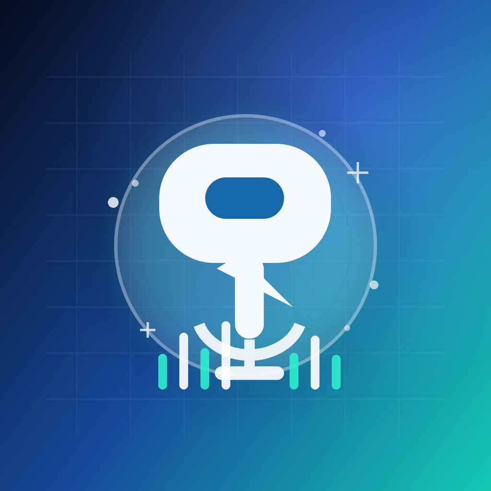

# PeterAI



PeterAI is a SwiftUI voice agent for iPhone and Apple Watch. It uses OpenAI's
Realtime API with `gpt-realtime-2` for live voice conversations, plus a small
web search tool for current information.

The app is intentionally simple: press play, talk to Peter, hear the answer,
and press pause to end the session.

## Features

- iPhone voice mode using the microphone and streamed audio playback.
- Apple Watch voice mode that relays audio through the paired iPhone.
- OpenAI Realtime session with `gpt-realtime-2`.
- Web search tool powered by the OpenAI Responses API.
- Live transcript bubbles on iPhone and Apple Watch.
- API key saved locally in the device Keychain.
- Manual API key sync from iPhone to Apple Watch.
- Dark mode interface with shared iPhone and Watch app icons.

## What this is not

- Not an always-listening background recorder.
- Not an App Store-ready product.
- Not a backend service. Your OpenAI API key is entered on-device.

## Requirements

- macOS with Xcode installed.
- Xcode with iOS 26.0+ platform support installed.
- For Apple Watch support: watchOS 26.0+ platform support installed.
- iPhone running iOS 26.0 or newer.
- Optional: Apple Watch running watchOS 26.0 or newer.
- A free [Apple Developer account](https://developer.apple.com/register/) added
  to Xcode for code signing.
- An OpenAI API key with access to `gpt-realtime-2` and web search.

You can clone the repo without the iOS/watchOS platform components, but Xcode
needs them installed before it can build, run, or install the app on devices.

## First-Time iOS Developers

You do not need a paid Apple Developer Program membership just to install this
on your own iPhone and Apple Watch from Xcode. Apple supports personal
on-device testing with a free Apple Account. Sign in at
[Apple Developer](https://developer.apple.com/register/), accept the Apple
Developer Agreement, then add the same account in **Xcode > Settings >
Accounts**.

A paid Apple Developer Program membership is mainly needed for App Store
distribution, TestFlight, broader device testing, and some advanced Apple
capabilities. Apple's
[membership comparison](https://developer.apple.com/support/compare-memberships/)
explains the current limits for free personal teams.

## Cost Notes

PeterAI uses OpenAI's Realtime API, so conversations are billed by API usage.
At the time this README was updated on May 16, 2026, `gpt-realtime-2` pricing
is:

- Audio: $32.00 / 1M input tokens, $0.40 / 1M cached input tokens, and
  $64.00 / 1M output tokens.
- Text: $4.00 / 1M input tokens, $0.40 / 1M cached input tokens, and
  $24.00 / 1M output tokens.
- Web search: $10.00 / 1,000 calls.

Check the current [OpenAI API pricing](https://openai.com/api/pricing/) before
long sessions or public demos.

## Device Setup

PeterAI is installed from Xcode, not the App Store. Before the app can run on
real devices, iPhone and Apple Watch may need Developer Mode enabled.

### iPhone

1. Connect the iPhone to your Mac and pair it with Xcode.
2. Open **Settings > Privacy & Security > Developer Mode**.
3. Turn on Developer Mode, restart the iPhone if prompted, then confirm after
   restart.
4. If iOS blocks the app as an untrusted developer, open **Settings > General >
   VPN & Device Management**, select your developer app/profile, and trust it.

### Apple Watch

1. Keep the Watch paired with the iPhone, unlocked, on your wrist, and near the
   Mac. The Watch installs wirelessly through the paired iPhone.
2. Open **Settings > Privacy & Security > Developer Mode** on Apple Watch.
3. Turn on Developer Mode, restart the Watch if prompted, then confirm after
   restart.
4. If Xcode cannot install the Watch app, keep the iPhone connected and unlocked,
   keep the Watch awake, then run the Watch target again from Xcode.

## Setup

1. Clone the repo.
2. Open `PeterAI/PeterAI.xcodeproj` in Xcode.
3. Select the `PeterAI` project and open **Signing & Capabilities**.
4. Set your Apple development team for both the iPhone and Watch targets.
5. Change the placeholder bundle IDs to unique values:
   - iPhone target: `com.yourname.peterai`
   - Watch target: `com.yourname.peterai.watchkitapp`
6. Make sure the Watch target's companion app bundle identifier matches the
   iPhone bundle ID.
7. Install on iPhone first: connect the iPhone to the Mac, keep the iPhone
   unlocked with the screen on, trust the Mac if prompted, select the iPhone run
   destination, and run.
8. Open PeterAI on the iPhone once and confirm the app launches.
9. If using Apple Watch, keep the iPhone connected to the Mac and unlocked, keep
   the Watch paired, unlocked, on your wrist, and connected to the iPhone, then
   run the Watch target from Xcode.

## Optional Codex Setup Prompt

After cloning the repo and opening `PeterAI/PeterAI.xcodeproj` in Xcode, you can
paste this prompt into Codex to have it guide the local install:

```text
You are in the PeterAI repo I just cloned. Xcode is already open with
PeterAI/PeterAI.xcodeproj.

Please set up and install this app on my real devices. Do not delete files,
rewrite the app, or make unrelated refactors. Preserve the existing project and
only make the minimum setup changes needed for my local machine.

Use Xcode for the install. If you need to operate the Xcode UI or device prompts,
use Computer Use. Help me set my Apple development team for both the iPhone and
Apple Watch targets, choose unique bundle identifiers, and confirm the iOS 26.0+
and watchOS 26.0+ platform components are installed.

Install and run the iPhone app first. My iPhone should stay connected to the Mac,
unlocked, and with the screen on. After the iPhone app launches, install and run
the Apple Watch app. My Apple Watch should be paired to the iPhone, unlocked, on
my wrist, near the Mac, and connected wirelessly to the iPhone.

If Developer Mode, trusted developer, provisioning, signing, privacy, microphone,
or network permission prompts appear, stop and tell me the exact steps to approve
them on the device before continuing.

Do not commit or push changes unless I explicitly ask.
```

## Using The App

### iPhone

1. Open PeterAI.
2. Paste your OpenAI API key.
3. Tap the key button to save it.
4. Press **Play** and talk.
5. Press **Pause** to end the conversation.

### Apple Watch

1. Open PeterAI on iPhone first.
2. Open PeterAI on Apple Watch.
3. In the iPhone app, tap **Send API key to Apple Watch**.
4. On the Watch, tap **Sync Key** if needed.
5. Press play on the Watch and talk to Peter.

The current Watch implementation routes the Realtime connection through the
iPhone. Keep the iPhone nearby and avoid force-closing the iPhone app while
using the Watch app.

## Privacy Notes

- The app uses the microphone only while voice mode is active.
- Transcripts are shown in the current UI and can be cleared.
- The OpenAI API key is stored locally in Keychain.
- Do not commit API keys, provisioning profiles, certificates, or local notes.

## License

MIT
